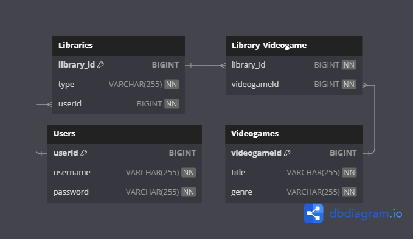

# API Rest: Libreria Videojuegos

## Idea del Proyecto

Este proyecto consiste en una aplicación web que lo que nos permite a partir de una base de datos de videojuegos general, organizarlos en librerías o colecciones creadas por nosotros mismos, para poder organizar cualquier videojuego como queramos. Por ejemplo, creamos la colección de "Deseados" y ya a partir de eso metemos en esa lista videojuegos que estén disponibles en la base de datos

***

## Justificación del Proyecto

La justificación de este proyecto radica en la creciente popularidad de los videojuegos y la necesidad de los jugadores de organizar y gestionar sus colecciones de manera eficiente. Actualmente, no existe una herramienta específica que permita a los usuarios llevar un registro detallado de sus videojuegos, incluyendo información sobre el estado de juego (por jugar, completados, etc.). Esta aplicación facilitará la gestión de las colecciones de videojuegos y mejorará la experiencia de los jugadores. Tambien nace la idea del proyecto a nivel personal por la necesidad de tener un sitio donde organizar todos mis videojuegos ya sean digitales o físicos.

***

## Tablas

Este proyecto usa 3 tablas principales y 1 tabla de unión

### Descripción

#### Users

La tabla Users almacena información sobre los usuarios de la aplicación. Cada usuario tiene un identificador único, un nombre de usuario y una contraseña.

**userId**: Un identificador único para cada usuario (Clave Primaria).&#x20;

**username**: El nombre de usuario del usuario, que es obligatorio y debe ser único.&#x20;

**password**: La contraseña del usuario, que es obligatoria.

#### Videogames

La tabla Videogames almacena información sobre los videojuegos. Cada videojuego tiene un identificador único, un título y un género.

\
**videogameId**: Un identificador único para cada videojuego (Clave Primaria).&#x20;

**title**: El título del videojuego, que es obligatorio.&#x20;

**genre**: El género del videojuego, que es obligatorio.

#### Libraries

La tabla Libraries almacena información sobre las bibliotecas creadas por los usuarios. Cada biblioteca tiene un identificador único, un tipo y una referencia al usuario que la creó.

\
**library\_id**: Un identificador único para cada biblioteca (Clave Primaria).&#x20;

**type**: El tipo de la biblioteca (por ejemplo, "por jugar", "completados"), que es obligatorio.&#x20;

**userId**: Una referencia al usuario que creó la biblioteca (Clave Foránea).

#### Library\_Videogame

La tabla Library\_Videogame es una tabla de unión que establece una relación de muchos a muchos entre bibliotecas y videojuegos. Cada entrada en esta tabla vincula una biblioteca con un videojuego.&#x20;

**library\_id**: Una referencia a la biblioteca (Clave Foránea).&#x20;

**videogameId**: Una referencia al videojuego (Clave Foránea).&#x20;

**PRIMARY KEY (library\_id, videogameId)**: Clave primaria compuesta para asegurar que cada combinación de biblioteca y videojuego sea única.

### Diagrama Entidad/Relación

<figure><figcaption></figcaption></figure>

***

## Endpoints

#### Endpoints de Usuario

* **POST /users/register**: Registra un nuevo usuario en la plataforma.
  * **Respuesta**: Código 201 (Created) o 400 (Bad Request).
* **POST /users/login**: Inicia sesión con un usuario existente.
  * **Respuesta**: Código 200 (OK) o 400 (Bad Request).
* **GET /users**: Obtiene una lista de todos los usuarios.
  * **Respuesta**: Código 200 (OK) o 403 (Forbidden).

#### Endpoints de Bibliotecas

* **GET /libraries**: Obtiene una lista de todas las bibliotecas.
  * **Respuesta**: Código 200 (OK) o 403 (Forbidden).
* **GET /libraries/user/{userId}**: Obtiene todas las bibliotecas de un usuario específico por ID.
  * **Respuesta**: Código 200 (OK) o 404 (Not Found).
* **GET /libraries/user/{userId}/type/{type}**: Obtiene todas las bibliotecas de un usuario específico por ID y tipo de biblioteca.
  * **Respuesta**: Código 200 (OK) o 404 (Not Found).
* **POST /libraries**: Crea una nueva biblioteca.
  * **Respuesta**: Código 201 (Created) o 400 (Bad Request).
* **DELETE /libraries/{id}**: Elimina una biblioteca por ID.
  * **Respuesta**: Código 204 (No Content) o 404 (Not Found).
* **POST /libraries/{libraryId}/add**: Añade videojuegos a una biblioteca.
  * **Respuesta**: Código 200 (OK) o 400 (Bad Request).
* **DELETE /libraries/{libraryId}/delete**: Elimina videojuegos de una biblioteca.
  * **Respuesta**: Código 200 (OK) o 400 (Bad Request).

#### Endpoints de Videojuegos

* **GET /videogames**: Obtiene una lista de todos los videojuegos.
  * **Respuesta**: Código 200 (OK).
* **GET /videogames/{videogameId}**: Obtiene los detalles de un videojuego específico por ID.
  * **Respuesta**: Código 200 (OK) o 404 (Not Found).
* **POST /videogames**: Crea un nuevo videojuego.
  * **Respuesta**: Código 201 (Created), 400 (Bad Request) o 403 (Forbidden).
* **PUT /videogames/{videogameId}**: Actualiza un videojuego específico por ID.
  * **Respuesta**: Código 200 (OK), 404 (Not Found) o 403 (Forbidden).
* **DELETE /videogames/{videogameId}**: Elimina un videojuego por ID.
  * **Respuesta**: Código 204 (No Content), 404 (Not Found) o 403 (Forbidden).

#### Excepciones y códigos de estado

* **400 (Bad Request)**: Datos inválidos (Ej: datos faltantes o incorrectos).
* **404 (Not Found)**: Entidad no encontrada (Ej: usuario, biblioteca o videojuego inexistente).
* **201 (Created)**: Creación exitosa de una entidad.
* **200 (OK)**: Operación exitosa.
* **204 (No Content)**: Eliminación exitosa de una entidad.
* **401 (Unauthorized)**: Usuario sin autentificar (Todos los endpoints menos login y register)
* **403 (Forbidden)**: Usuario si rol necesario para acceder

***

## Lógica de Negocio

### Usuarios

#### Registro:

* Verificar que la contraseña cumpla con los requisitos mínimos (Min 6 carácteres).
* Validar que los datos de entrada (nombre de usuario y contraseña)
* Validar que el nombre de usuario sea único
* Guardar el nuevo usuario en la base de datos.

#### Inicio de sesión:

* Validar las credenciales del usuario (nombre de usuario y contraseña).
* Generar un token de autenticación si las credenciales son válidas.

#### Gestión de usuarios:

* Lista de todos los usuarios (Solo accesible para administradores)

#### Roles y permisos:

* Definir roles de usuario (ADMIN o USER).&#x20;

#### Validaciones:

* Validar los datos de entrada para el registro y la autenticación.&#x20;
* Asegurarse de que los campos obligatorios no estén vacíos y cumplan con los requisitos.&#x20;

### Videojuegos

#### Registro de videojuegos:

* Validar que los datos de entrada (nombre del videojuego, género, etc.) no estén vacíos.&#x20;
* Validar que el nombre del juego sea único.
* Guardar el nuevo videojuego en la base de datos.&#x20;

#### Gestión de videojuegos (Solo disponibles para Administradores):

* Obtener una lista de todos los videojuegos.&#x20;
* Actualizar la información de un videojuego existente aportando su ID para buscarlo primero.&#x20;
* Eliminar un videojuego de la base de datos por su ID.&#x20;

#### Validaciones:

* Validar los datos de entrada para el registro y la actualización de videojuegos.&#x20;
* Asegurarse de que los campos obligatorios no estén vacíos y cumplan con los requisitos.

### Librerías

#### Registro de bibliotecas:

* Validar que los datos de entrada (nombre de la biblioteca, tipo, etc.) no estén vacíos.&#x20;
* Guardar la nueva biblioteca en la base de datos.&#x20;

#### Gestión de bibliotecas:

* Obtener una lista de todas las bibliotecas (Solo Administradores).&#x20;
* Obtener bibliotecas por userId y type.&#x20;
* Obtener bibliotecas por userId.&#x20;
* Eliminar una biblioteca de la base de datos.&#x20;

#### Gestión de videojuegos en bibliotecas:

* Añadir videojuegos a una biblioteca.&#x20;
* Eliminar videojuegos de una biblioteca.&#x20;

#### Validaciones:

* Validar los datos de entrada para el registro y la actualización de bibliotecas.&#x20;
* Asegurarse de que los campos obligatorios no estén vacíos y cumplan con los requisitos.
